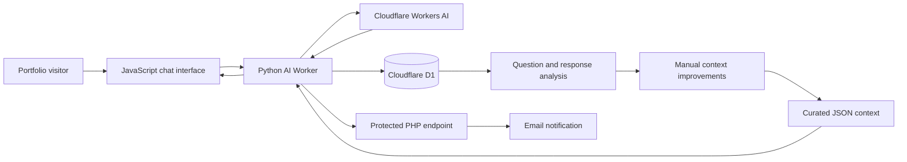

# Federico Cabello | Software Engineer Portfolio

[](https://federicocabello.net/)
[](#languages)


Professional bilingual portfolio focused on AI programming, data analytics, full-stack development, CRM platforms, business management systems, and databases. It presents real project case studies, professional experience, technical skills, education, and direct contact options.

**Live site:** [federicocabello.net](https://federicocabello.net/)

## Highlights

- English and Spanish interface with persistent language selection.
- Project case studies grouped by category and loaded from JSON files.
- Responsive project galleries, image viewer, links, technologies, and demo status.
- Interactive AI assistant developed with Python and portfolio-specific context.
- Conversation history stored in Cloudflare D1 for question-frequency analysis.
- Data-driven context improvement based on recurring visitor interests.
- Contact form and AI-response notifications delivered by email.
- Responsive layout designed for desktop, tablet, and mobile devices.
- Language-aware CV links and social sharing metadata.

## Technology

| Area | Technologies |
| --- | --- |
| Frontend | HTML5, CSS3, JavaScript, Bootstrap, jQuery |
| UI | Font Awesome, Iconify, Owl Carousel |
| Content | JSON, custom internationalization system |
| AI API | Python, Cloudflare Workers AI |
| Data | Cloudflare D1 |
| Notifications | PHP, PHPMailer, Gmail SMTP |
| Hosting | Hostinger, Cloudflare |

## AI and Data Workflow

The portfolio includes a production AI assistant built as a separate Python service. It answers questions using curated portfolio data, preserves short conversational context, records anonymous interactions, and supports analysis of the most frequent questions. This information helps refine the assistant without allowing visitors to modify its knowledge directly.



### Data Analytics Focus

- Captures anonymous questions, answers, language, status, and timestamps.
- Identifies recurring questions and visitor interests through aggregated queries.
- Uses the findings to improve portfolio content and the assistant's curated knowledge.
- Applies Pandas and NumPy across data-oriented portfolio projects for reporting, operational metrics, and decision support.

## Project Structure

```text
.
|-- api/                    # Protected email notification endpoint
|-- css/                    # Styles and responsive layout
|-- data/                   # Public context used by the AI assistant
|-- fonts/                  # Local font assets
|-- img/
|   `-- projects/           # Project metadata, covers, and screenshots
|-- js/                     # UI, translations, projects, chat, and contact logic
|-- portfolio-ai-worker/    # Python Cloudflare Worker and D1 schema
|-- index.html              # Main portfolio document
`-- default.php             # Hostinger-compatible entry document
```

Each project can define its content in `img/projects/<project>/project.json`. Images use `portada.png` as the cover and numbered files such as `1.png`, `2.png`, and `3.png` for galleries.

## Local Development

The frontend has no build step. Serve the repository through a local HTTP server so JSON project files can be loaded correctly:

```powershell
python -m http.server 8000
```

Then open [http://localhost:8000](http://localhost:8000).

Opening `index.html` directly is not recommended because browsers can restrict local `fetch()` requests.

### AI Worker

The assistant is implemented separately in `portfolio-ai-worker/`. It requires a Cloudflare account and Wrangler:

```powershell
cd portfolio-ai-worker
npx wrangler dev
```

Deployment and D1 setup instructions are available in [portfolio-ai-worker/README.md](portfolio-ai-worker/README.md).

## Deployment

1. Upload the public frontend files and folders to the web root on Hostinger.
2. Install the dependencies from `api/composer.json` on the server for email delivery.
3. Keep SMTP credentials and notification secrets outside `public_html`.
4. Deploy `portfolio-ai-worker/` independently with Wrangler.
5. Configure the deployed Worker URL in the `portfolio-ai-endpoint` meta tag in `index.html`.

Do not upload local Worker files such as `.dev.vars`, `.wrangler/`, `.venv/`, or Wrangler log files. No API key or SMTP password should be committed to this repository.

## Languages

### Español

Portfolio profesional bilingüe orientado a la programación de inteligencia artificial, el análisis de datos, el desarrollo full stack, las plataformas CRM, los sistemas de gestión empresarial y las bases de datos. Incluye casos de estudio, experiencia profesional, stack tecnológico, formación y medios de contacto.

El agente de IA está desarrollado en Python, utiliza un contexto controlado y registra interacciones anónimas en Cloudflare D1. Estos datos permiten analizar las preguntas más frecuentes y mejorar manualmente la información disponible sin contaminar el conocimiento del asistente.

Para ejecutarlo localmente, inicia un servidor HTTP con `python -m http.server 8000` y visita `http://localhost:8000`. El agente de IA se despliega por separado desde `portfolio-ai-worker/`.

## Author

**Federico Cabello**  
Software Engineer  
[Website](https://federicocabello.net/) | [LinkedIn](https://www.linkedin.com/in/federicocabello/) | [GitHub](https://github.com/federicocabello)

This repository contains personal portfolio content. All rights reserved unless otherwise stated.
